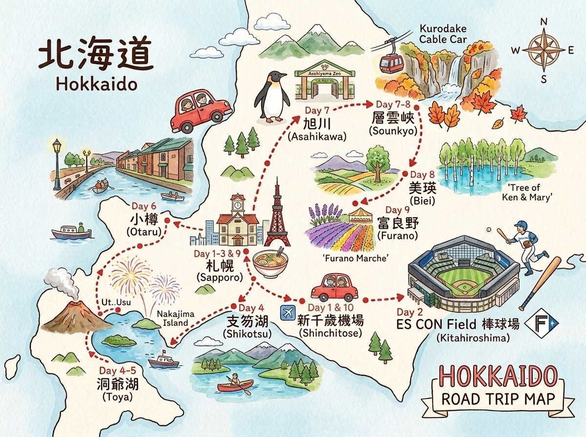

# 北海道 2026 暑假｜旅遊檢查清單
**出發：** 7/31（五）｜**回程：** 8/9（日）｜**成員：** 2大1小

## 🗺️ 旅遊路線地圖 (手繪卡通中日對照)

---

## 🎫 機票

| 項目 | 狀態 | 備註 |
|------|------|------|
| 去程機票（→ 新千歲）| ☐ 未訂 / ✅ 已訂 | 航班：________ 時間：7/31 抵達 10:00 前 |
| 回程機票（新千歲 →）| ☐ 未訂 / ✅ 已訂 | 航班：________ 時間：8/9 15:00 出發 |
| 座位選好 | ☐ | 建議靠窗，小孩夾中間 |
| 行李額度確認 | ☐ | 確認托運件數與重量限制 |

---

## 🏨 住宿

| 日期 | 地點 | 狀態 | 飯店名稱 | 訂房確認碼 |
|------|------|------|----------|-----------|
| 7/31–8/2（3晚）| 札幌 | ☐ 未訂 / ✅ 已訂 | | |
| 8/3–8/4（2晚）| 洞爺湖溫泉 | ☐ 未訂 / ✅ 已訂 | | |
| 8/5（1晚）| 小樽 | ☐ 未訂 / ✅ 已訂 | | |
| 8/6（1晚）| 層雲峽溫泉 | ☐ 未訂 / ✅ 已訂 | | |
| 8/7（1晚）| 美瑛 | ☐ 未訂 / ✅ 已訂 | | |
| 8/8（1晚）| 札幌 | ☐ 未訂 / ✅ 已訂 | | |

> ⚠️ 洞爺湖溫泉旅館夏季旺季，盡早預訂！建議選有湖景房+附早晚餐方案。

---

## 🚗 租車

| 項目 | 狀態 | 備註 |
|------|------|------|
| 租車預約 | ☐ 未訂 / ✅ 已訂 | 取車：8/3（一）札幌市區，還車：8/8（六）|
| 車型確認 | ☐ | 建議 SUV（含導航）|
| 兒童座椅預約 | ☐ | 1個（8歲，確認需要哪種規格）|
| 台灣駕照日文翻譯本 | ☐ | 至各縣市監理站或 AA 車輛協會辦理，需帶台灣駕照正本 |
| 國際駕照（備用）| ☐ | 可加辦以備不時之需 |
| ETC 卡預約 | ☐ | 強烈建議，北海道高速公路多，省時省錢 |

---

## ⚾ 已預訂項目

| 項目 | 狀態 | 備註 |
|------|------|------|
| ES CON Field 球票（8/1）| ✅ 已預訂 | 確認票面開賽時間（14:00 或 18:00）|
| 球票列印或手機截圖 | ☐ | 存至手機離線備用 |

---

## 🛶 活動預約

| 項目 | 日期 | 狀態 | 備註 |
|------|------|------|------|
| 支笏湖獨木舟 | 8/3 | ☐ 未訂 / ✅ 已訂 | 夏季極快滿，出發前 2–3 週務必預約。推薦：支笏湖ネイチャーセンター |

---

## 🚃 交通票券

| 項目 | 狀態 | 備註 |
|------|------|------|
| JR 快速エアポート 指定席（去程）| ☐ | 7/31 新千歲→札幌，2大1小 |
| JR 快速エアポート 指定席（回程）| ☐ | 8/9 札幌→新千歲，2大1小，10:30 班次 |
| ES CON 接駁巴士確認 | ☐ | 8/1，北広島站→ ES CON（比賽日才有）|

---

## 📄 文件證件

| 項目 | 狀態 | 備註 |
|------|------|------|
| 護照有效期 | ☐ | 三人護照均需有效期 6 個月以上（至 2027/1 以後）|
| 護照影本 | ☐ | 各自攜帶一份，另存雲端備份 |
| 日本入境表格 | ☐ | 可預先填寫 Visit Japan Web（電子申報）|
| Visit Japan Web 登錄 | ☐ | 入境審查+海關申報，省排隊時間 |
| 旅遊保險 | ☐ | 建議含緊急醫療+行李遺失，信用卡附加保險確認是否足夠 |
| 信用卡海外通知開通 | ☐ | 確認三張以上可用卡，通知銀行出國 |

---

## 📱 通訊 & 導航

| 項目 | 狀態 | 備註 |
|------|------|------|
| 日本 eSIM 購買 | ☐ | 推薦 IIJmio 或 HISモバイル，出發前啟用 |
| Google Maps 離線地圖下載 | ☐ | 下載北海道地圖，以防訊號不佳 |
| 日本緊急電話確認 | ☐ | 警察：110，救護：119 |
| 翻譯 App 安裝 | ☐ | Google 翻譯，下載日文離線包 |
| 充電線/行動電源 | ☐ | 確認插頭（日本 A 型，台灣通用）|

---

## 💰 金錢準備

| 項目 | 狀態 | 備註 |
|------|------|------|
| 日幣換匯 | ☐ | 建議帶 JPY 10–15 萬現金（部分溫泉旅館只收現金）|
| 台灣銀行 / 郵局匯率確認 | ☐ | 或用外幣提款機（7-11 ATM 可提日幣）|
| 零錢袋準備 | ☐ | 日本多用現金，停車費、販賣機等 |

---

## 🎒 行李準備

### 衣物
| 項目 | 狀態 |
|------|------|
| 夏季輕薄衣物（8月白天熱）| ☐ |
| 薄外套/長袖（層雲峽涼，晚間溫泉旅館冷）| ☐ |
| 雨衣或折疊傘 | ☐ |
| 泳衣（部分溫泉旅館有游泳池）| ☐ |
| 舒適步行鞋（動物園、健行）| ☐ |
| 拖鞋（溫泉旅館室內）| ☐ |

### 日常用品
| 項目 | 狀態 |
|------|------|
| 防曬乳 SPF50+（8月烈日）| ☐ |
| 防蚊液（美瑛・大雪山戶外）| ☐ |
| 常備藥（頭痛藥・腸胃藥・感冒藥）| ☐ |
| 小孩常用藥物 | ☐ |
| 濕紙巾・面紙 | ☐ |
| 環保袋（購物）| ☐ |

### 3C & 配件
| 項目 | 狀態 |
|------|------|
| 相機 + 記憶卡 + 電池 | ☐ |
| 手機支架/自拍棒 | ☐ |
| 多孔插座延長線（旅館只有少數插頭）| ☐ |
| 車用手機架（開車導航用）| ☐ |

---

## 🏥 小孩相關

| 項目 | 狀態 | 備註 |
|------|------|------|
| 健保卡（在日使用需自費，但回台可申請補助）| ☐ | |
| 小孩護照確認 | ☐ | |
| 暈車藥備用 | ☐ | 長途開車（層雲峽路段山路較多）|
| 耳塞（ES CON 球場）| ☐ | |
| 小孩娛樂（平板/書/玩具）| ☐ | 長途開車備用 |
| 小孩零食備用 | ☐ | 便利店補充 |

---

## 🛍️ 伴手禮採購清單（提醒）

| 品項 | 購買地點 | 狀態 |
|------|----------|------|
| 白色戀人（限量口味）| 新千歲機場 / 白色戀人公園（札幌）| ☐ |
| ROYCE' 生巧克力 | 新千歲機場 | ☐ |
| 六花亭奶油酥餅 | 各地均有、機場 | ☐ |
| 三方六（長崎年輪蛋糕）| 新千歲機場 | ☐ |
| LeTAO 起司蛋糕（常溫版）| 小樽堺町通り（8/5）| ☐ |
| 薰衣草相關商品 | Farm Tomita（8/8）| ☐ |
| 富良野起司 | 富良野チーズ工房（8/8）| ☐ |
| 北海道玉米（加工品）| 美瑛選果（8/7）| ☐ |

---

## ✅ 出發前最終確認（7/30 前）

| 項目 | 狀態 |
|------|------|
| 所有住宿確認信列印或截圖存檔 | ☐ |
| 租車確認信列印，標注取車地址 | ☐ |
| 每天行程表存至手機離線（本檔案）| ☐ |
| 緊急聯絡人通知 | ☐ |
| 家門鑰匙/植物/郵件交代好 | ☐ |
| 行李超重確認（通常 23kg/件）| ☐ |
| 藥妝退稅文件準備（免稅購物需護照）| ☐ |
